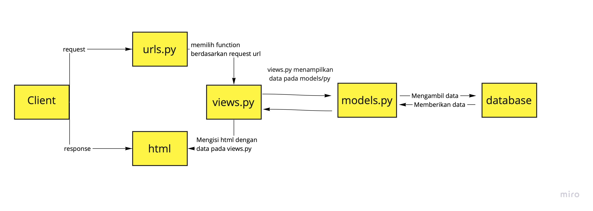

Link heroku : https://tugas-2-pbp-afra.herokuapp.com



#Virtual Environment
Virtual environment merupakan sebuah lingkungan Python di mana Python interpreter, library, dan skrip yang diinstal ke dalamnya diisolasi dari yang diinstal di lingkungan virtual lain, dan (secara default) pustaka apa pun yang diinstal di "sistem" Python. Alat instalasi umum seperti setuptools dan pip berfungsi menginstall library tersebut ke lingkungan virtual.Jika kita tidak menggunakan virtual environment, maka pip akan menempatkan semua paket eksternal yang Anda instal di folder bernama site-packages/ di instalasi Python dasar.

Alasan lain kita perlu menggunakan virtual environment adalah :
1.
2.
3.

#Cara implementasi poin 1-4
##1.Membuat sebuah fungsi pada views.py yang dapat melakukan pengambilan data dari model dan dikembalikan ke dalam sebuah HTML.
Membuat fungsi show_catalog dengan parameter request dari client, yang mengembalikan fungsi render(request, "katalog.html", context) yaitu fungsi yang membuat html berdasarkan request dan berisi context. Context berisi catalog_items, name, dan student_id. Untuk name dan student_id, saya mendeklarasikannya secara manual dengan meng-assign nama dan NPM saya. Sedangkan untuk catalog_items, saya meng-assign data dari database yakni CatalogItem dengan memanggil CatalogItem.objects.all().

##2.Membuat sebuah routing untuk memetakan fungsi yang telah kamu buat pada views.py.
Pada `urlspatterns` di `urls.py` pada `project_django`, saya menambahkan `path('katalog/', include('katalog.urls'))` untuk memberikan routing pada aplikasi katalog, sehingga browser dapat mengaksesnya melalui url awal ditambah path `/katalog`. Sedangkan, pada `urls.py` di folder `katalog` saya menambahkan aplikasi bernama `app_name` berupa `katalog` dan menambahkan ```urlpatterns = [
    path('', show_katalog, name = "show_katalog"),
]```

##3.Memetakan data yang didapatkan ke dalam HTML dengan sintaks dari Django untuk pemetaan data template.
Untuk mendapatkan data dari `context` yang telah dikirim, saya melakukan pemanggilan pada `katalog.hmtl`. Pada bagian `fill me` saya mengisi `{{nama}}` dan `student_id` untuk mendapatkan nama dan NPM yang telah saya deklarasikan di `views.py`. Selanjutnya, saya melakukan iterasi untuk setiap `item` pada `catalog_items` di mana setiap data yang ingin diambil dipanggil dari atribut `item` tersebut.

Selanjutnya, saya melakukan migrasi data menggunakan `python manage.py makemigrations` , `python manage.py migrate` lalu memasukkan data pada `initial_catalog_data.json` dengan command `python manage.py loaddata initial_catalog_data.json.

##4.Melakukan deployment ke Heroku terhadap aplikasi yang sudah kamu buat sehingga nantinya dapat diakses oleh teman-temanmu melalui Internet.
Pertama, saya membuat aplikasi pada heroku bernama `tugas-2-pbp-afra` lalu membuat `HEROKU_APP_NAME` dan `HEROKU_API_KEY`dan menyambungkannya ke github.

Referensi :
https://docs.python.org/3/library/venv.html
https://pbp-fasilkom-ui.github.io/ganjil-2023/assignments/tutorial/tutorial-1
