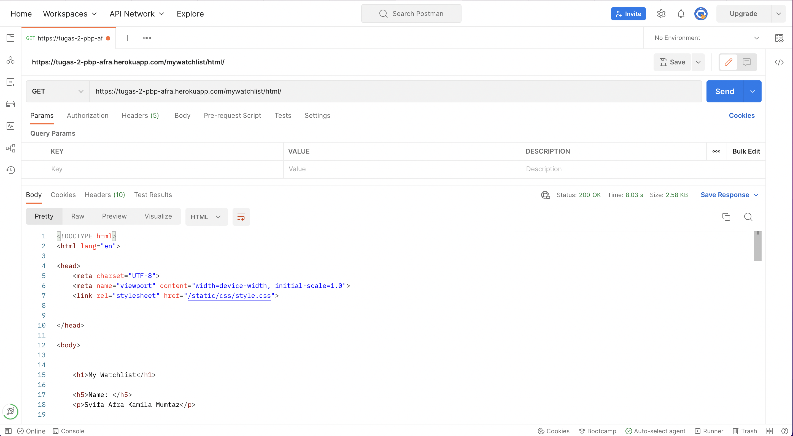
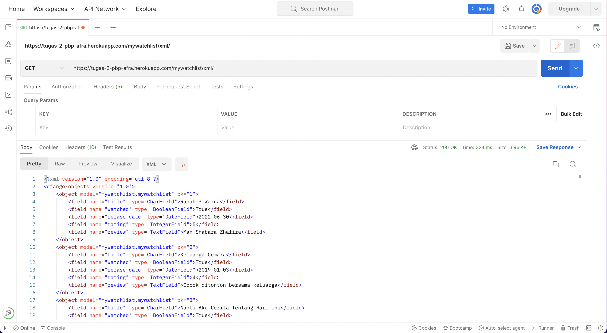
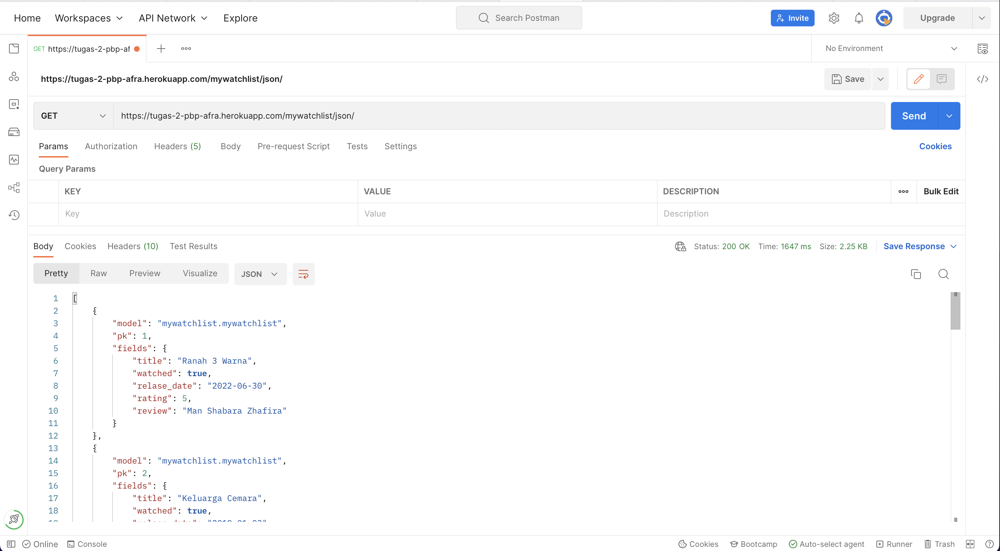

# TUGAS 3 PBP
* Link HTML : https://tugas-2-pbp-afra.herokuapp.com/mywatchlist/html/
* Link XML : https://tugas-2-pbp-afra.herokuapp.com/mywatchlist/xml/
* Link JSON : https://tugas-2-pbp-afra.herokuapp.com/mywatchlist/json/
&nbsp;

## Perbedaan antara JSON, XML, dan HTML

JSON adalah singkatan dari JavaScript Object Notation. JSON didesain menjadi self-describing, sehingga JSON sangat mudah untuk dimengerti. JSON digunakan pada banyak aplikasi web maupun mobile, yaitu untuk menyimpan dan mengirimkan data. Sintaks JSON merupakan turunan dari Object JavaScript. Akan tetapi format JSON berbentuk text, sehingga kode untuk membaca dan membuat JSON banyak terdapat dibanyak bahasa pemrograman.

XML adalah singkatan dari eXtensible Markup Language. XML didesain menjadi self-descriptive, jadi dengan membaca XML tersebut kita bisa mengerti informasi apa yang ingin disampaikan dari data yang tertulis. XML digunakan pada banyak aplikasi web maupun mobile, yaitu untuk menyimpan dan mengirimkan data. XML hanyalah informasi yang dibungkus di dalam tag. Kita perlu menulis program untuk mengirim, menerima, menyimpan, atau menampilkan informasi tersebut.

JSON dan XML sama-sama dapat "mendeskripsikan diri sendiri" (dapat dibaca manusia,bersifat hierarkis (nilai di dalam nilai), dapat diuraikan dan digunakan oleh banyak bahasa pemrograman, dapat diambil dengan XMLHttpRequest, namun JSON tidak menggunakan tag akhir, lebih pendek, lebih cepat untuk membaca dan menulis dan dapat menggunakan array.

Sedangkan, HTML adalah singkatan dari Hyper Text Markup Language. HTML adalah bahasa markup standar untuk membuat halaman Web HTML menggambarkan struktur halaman Web HTML terdiri dari serangkaian elemen elemen HTML

## Alasan memerlukan data delivery dalam pengimplementasian sebuah platform
Dalam mengembangkan suatu platform, ada kalanya kita perlu mengirimkan data dari satu stack ke stack lainnya. Bisa dalam bentuk halaman HTML, style sheet, gambar JPG, code JavaScript atau data XLM/JSON. Supaya dapat memenuhi seluruh kebutuhan tersebut, maka kita melakukan data delivery.

## Cara Implementasi
### Membuat suatu aplikasi baru bernama mywatchlist di proyek Django Tugas 2 pekan lalu
Pertama-tama, saya membuat virtual environment dan melakukan instalasi requirements yang dibutuhkan. Lalu melakukan `python manage.py startapp mywatchlist` untuk membuat aplikasi mywatchlist. Kemudian menambahkan `mywatchlist` di `INSTALLED_APPS` pada `settings.py` 

### Menambahkan path mywatchlist 
Pada `urlpatterns` di `urls.py` dalam folder `project_django` saya menambahkan `path('mywatchlist/', include('mywatchlist.urls'))` sehingga pengguna dapat mengakses http://localhost:8000/mywatchlist  

### Membuat sebuah model MyWatchList
Pada `models.py` saya membuat class `MyWatchList` yang memiliki field :
    * title berupa karaker dengan panjang maksimal 255
    * watched berupa boolean
    * release_date berupa tanggal
    * rating berupa angka 1-5
    * review berupa text
Lalu saya melakukan migrasi dengan command `python manage.py makemigrations` dan `python manage.py migrate`

### Menambahkan minimal 10 data untuk objek MyWatchList yang sudah dibuat di atas
Saya membuat folder `fixtures` pada `mywatchlist` yang berisi `initial_mywatchlist_data.json` lalu mengisi data JSON dengan contoh `initial_catalog_data.json` pada Tugas 2 minggu lalu dengan penyesuian field yang dibuat pada `models.py` sebelumnya.
Untuk memasukannya ke database, saya melakukan command `python manage.py loaddata initial_watchlist_data.json`.

### Mengimplementasikan sebuah fitur untuk menyajikan data yang telah dibuat sebelumnya dalam tiga format:
Pada `views.py` saya membuat fungsi `show_html`, `show_xml`, dan `show_json` dengan mengambil seluruh data yang dibutuhkan menggunakan `MyWatchList.objects.all()`. Untuk HTML, returnnya berupa `render(request, "mywatchlist.html", context)` di mana `mywatchlist.html` adalah file html yang sudah saya buat pada folder `templates` dengan memetakan data pada `context`.

### Membuat routing sehingga data di atas dapat diakses dalam format HTML, XML, dan JSON
Saya membuat `urls.py` pada folder `mywatchlist` lalu mengimporth path dan fungsi yang dibutuhkan, membuat aplikasi `mywatchlist` dan membuat `urlpatterns` yang berisi `path('html/', show_html, name = "show_html")`, `path('xml/', show_xml, name = "show_xml")`, dan `path('json/', show_json, name = "show_json")`.

### Melakukan deployment ke Heroku terhadap aplikasi yang sudah kamu buat sehingga nantinya dapat diakses oleh teman-temanmu melalui Internet.
Saya tidak melakukan deployment ulang karena menggunakan repositori yang sama dengan Tugas 2, namun pada Procfile saya menambahkan `python manage.py loaddata initial_watchlist_data.json` supaya terintegrasi dengan database.

## Postman

## Referensi :
* https://pbp-fasilkom-ui.github.io/ganjil-2023/assignments/tutorial/tutorial-2
* https://www.w3schools.com/js/js_json_xml.asp
* https://scele.cs.ui.ac.id/pluginfile.php/161284/mod_resource/content/1/04%20-%20Data%20Delivery.pdf

