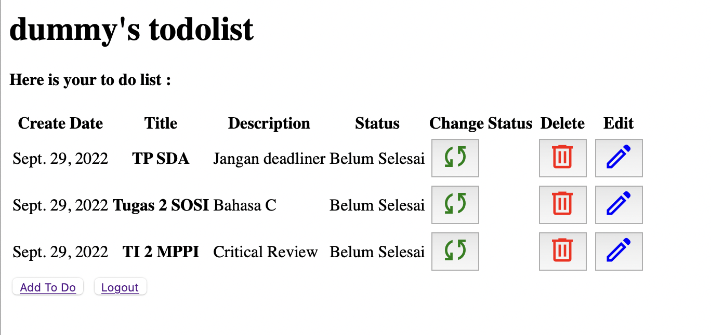
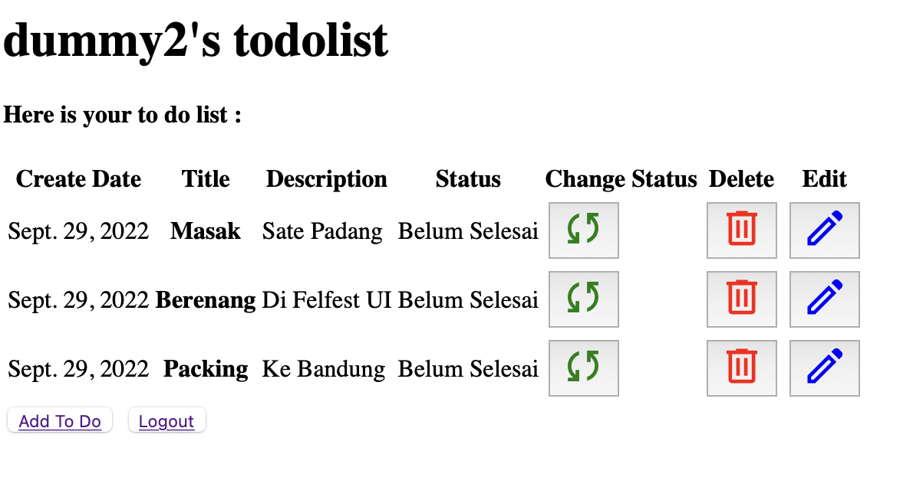

# Tugas 4

Link heroku : https://tugas-2-pbp-afra.herokuapp.com/todolist

## Apa kegunaan  pada elemen <form>? Apa yang terjadi apabila tidak ada potongan kode tersebut pada elemen <form>? ##
`csrf_token` adalah nilai unik, rahasia, dan tidak terprediksi yang dihasilkan oleh aplikasi sisi server dan dikirimkan ke klien sedemikian rupa sehingga disertakan dalam permintaan HTTP berikutnya yang dibuat oleh klien. Saat permintaan selanjutnya dibuat, aplikasi sisi server memvalidasi bahwa permintaan tersebut menyertakan token yang diharapkan dan menolak permintaan jika token tidak ada atau tidak valid. `csrf_token`dapat mencegah serangan CSRF dengan membuat penyerang tidak mungkin membuat permintaan HTTP yang sepenuhnya valid yang cocok untuk diumpankan ke pengguna korban. Karena penyerang tidak dapat menentukan atau memprediksi nilai `csrf_token` pengguna, mereka tidak dapat membuat permintaan dengan semua parameter yang diperlukan aplikasi untuk memenuhi permintaan tersebut.

## Cara membuat elemen <form> secara manual (tanpa menggunakan generator seperti {{ form.as_table }})?  ##
Kita tidak wajib menggunakan `{{ form.as_table }}` untuk membuat form. Form juga dapat dibuat secara manual dengan membuat tag <input> yang berisi atribut <name> ,<type>  dan <value> yang sesuai.

## Jelaskan proses alur data dari submisi yang dilakukan oleh pengguna melalui HTML form, penyimpanan data pada database, hingga munculnya data yang telah disimpan pada template HTML. ##
Melalui request POST input dari user pada form akan dikirim ke server. Lalu dengan menggunakan function `create_task` pada `views.py` input tersebut diubah menjadi `Task` berupa class `CreateTask` di `forms.py`, 
kemudian menyimpan data menggunakan method `save`. Data yang sudah disimpan dapat diakses melalui `Task.objects.all()` di dalam `views.py` lalu dimasukkan ke context kemudian di-render sehingga dapat dipakai pada `templates` html.
## Jelaskan bagaimana cara kamu mengimplementasikan checklist di atas. ##
1. Membuat aplikasi `todolist` :
Menggunakan command `python manage.py startapp todolist`
2. Membuat model Task :
Pada `models.py` saya menambahkan class baru bernama `Task` dengan atribut berupa id, user, date, title, description dan fungsi untuk mengubah dirinya sendiri ke bentuk string dengan return berupa title-nya.
3. Implementasi form registrasi, login, dan logout
    * Registrasi : Saya membuat fungsi `register` pada `views.py` kemudian menggunakan `UserCreationForm` untuk membuat form registrasi. Jika input nya sudah valid, maka form tersebut akan di save kemudian kembali ke halaman login, jika tidak maka page register akan di-refresh kembali
    * Login : Saya membuat fungsi `login_user` pada `views.py` kemudian mendapatkan username dan password menggunakan `request.POST.get` lalu di autentikasi apakah user tersebut sudah terdaftar atau belum. Jika sudah, maka akan dipanggil fungsi `login` dengan parameter `request` lalu menuju page utama `todolist`. Jika tidak maka page login akan di-refresh kembali.
    * Logout : Saya membuat fungsi `logout_user` pada `views.py` yang berisi pemanggilan fungsi `logout` denga parameter `request` lalu kembali ke halaman login
4.  Membuat halaman utama todolist :
Halaman utama saya buat di `todolist.html`. Penjelasan code sudah terdapat di dokumentasi code.
5. Membuat halaman form untuk pembuatan task :
Halaman form saya buat di `create_task.html`. Penjelasan code sudah terdapat di dokumentasi code.
6. Membuat routing :
Pada `settings.py` dalam `project_django` saya menambahkan aplikasi `todolist` pada `INSTALLED_APPS`. Kemudian di `urlspatterns` milik `urls.py` dalam `project_django` saya menambahkan `path('todolist/', include('todolist.urls'))`. Terakhir, saya mengisi `urls.py` di folder `todolist`.
7. Deployment ke Heroku :
Saat tugas 2, saya sudah melakukan Deployment ke Heroku, sehingga untuk Tugas 4, saya hanya perlu mengupdate repositori Github saya yang sudah tersambung ke Heroku.
8. Membuat dua akun pengguna dan tiga dummy data menggunakan model Task pada akun masing-masing di situs web Heroku.

## Referensi ##
https://portswigger.net/web-security/csrf/tokens

# Tugas 5 # 
## Apa perbedaan dari Inline, Internal, dan External CSS? Apa saja kelebihan dan kekurangan dari masing-masing style? ##
Inline CSS adalah style yang langsung ditulis dalam tag HTML menggunakan atribut style dalam satu baris. Internal CSS adalah style yang disematkan di dalam file HTML namun tidak satu baris. Sedangkan eksternal CSS adalah style yang dibuat pada file CSS. 

* Kelebihan dari Inline Style adalah membantu ketika hanya ingin menguji dan melihat perubahan pada satu elemen, memperbaiki kode dengan cepat, proses permintaan HTTP yang lebih kecil dan proses load website akan lebih cepat. Namun kekurangannya adalah kurang _managable_ dan tidak bisa dipakai ulang untuk elemen HTML lain baik dalam satu file maupun di luar file. 
* Kelebihan dari Internal Style adalah perubahan pada Internal CSS hanya berlaku pada satu halaman saja, tidak perlu melakukan upload beberapa file karena HTML dan CSS berada dalam satu file, Class dan ID bisa digunakan oleh internal stylesheet. namun kekurangannya adalah kurang _managable_ sehingga jika ingin merevisinya lebih sulit dan tidak bisa dipakai ulang untuk elemen HTML di luar file. 
* Kelebihan dari Eksternal Style adalah _managable_ dan dapat dipakai ulang baik dalam satu file maupun di luar file. Namun kekurangannya adalah halaman akan menjadi berantakan, ketika file CSS gagal dipanggil oleh file HTML.

## Jelaskan tag HTML5 yang kamu ketahui. ##
* Tag `<!DOCTYPE html>` adalah sebuah deklerasi atau untuk mengidentifikasi jenis dokumen HTML yang digunakan agar browser dapat menentukan bagaimana memperlakukan kode tersebut.
* Tag `<SECTION>` merupakan dokumen atau aplikasi bagian generik.
* Tag `<ARTICLE>` merupakan sepotong independen isi dokumen, seperti sebuah blog atau artikel koran.
* Tag `<HEADER>` merupakan bagian kepala dari dukumen.
* Tag `<FOOTER>` merupakan bagian catatan kaki yang dapat berisi informasi tentang penulis, informasi hak cipta, dll
* Tag `<NAV>` merupakan bagian dari dokumen yang dimaksudkan untuk memudahkan dalam proses navigasi.
* Tag `<FIGURE>` dapat digunakan untuk menghubungkan keterangan bersama-sama dengan beberapa konten tertanam, seperti gambar atau video.

## Jelaskan tipe-tipe CSS selector yang kamu ketahui. ##
* Element selector = Element selector menggunakan tag HTML sebagai selector untuk mengubah properti yang terdapat dalam tag tersebut.
* ID selector = ID selector menggunakan ID pada tag sebagai selector-nya.
* Class selector = Class selector menggunakan Class pada tag sebagai selector-nya.
## Cara Implementasi Kode Tugas 5 ##
1. Kustomisasi templat untuk halaman login, register, dan create-task semenarik mungkin.
Saya menggukanan Class card untuk menampung konten dari ketiga halaman tersebut, dengan menambakan : 
`
` dan
`
` yang sudah menggunakan _alignment center_ supaya berada di tengah. Saya juga menambahkan `` pada setiap file HTML supaya dapat memanfaatkan style CSS yang sudah saya buat pada file style.css dalam folder css di folder style.
2. Kustomisasi halaman utama todo list menggunakan cards. (Satu card mengandung satu task).
Sebelum for looping task yang ada, saya membuat `
` untuk membuat 3 row yang akan menampung task terebut. Selanjutnya, untuk setiap task, saya membuat Class Card dengan memanfaatkan bootsrap yang sudah dapat diakses dengan menambahkan `<link href="https://cdn.jsdelivr.net/npm/bootstrap@5.2.1/dist/css/bootstrap.min.css" rel="stylesheet" integrity="sha384-iYQeCzEYFbKjA/T2uDLTpkwGzCiq6soy8tYaI1GyVh/UjpbCx/TYkiZhlZB6+fzT" crossorigin="anonymous">` pada `base.html`
3. Membuat keempat halaman yang dikustomisasi menjadi responsive.
Dengan menggunakan `align-items-center`, `row-cols-3`, serta membuat form secara manual maka halaman tersebut dapat dikatakan sudah responsive. 

## Referensi ##
https://codepolitan.com/blog/pengenalan-html5-belajar-html
https://www.niagahoster.co.id/blog/perbedaan-internal-external-dan-inline-css/#Manfaat_Inline_CSS

